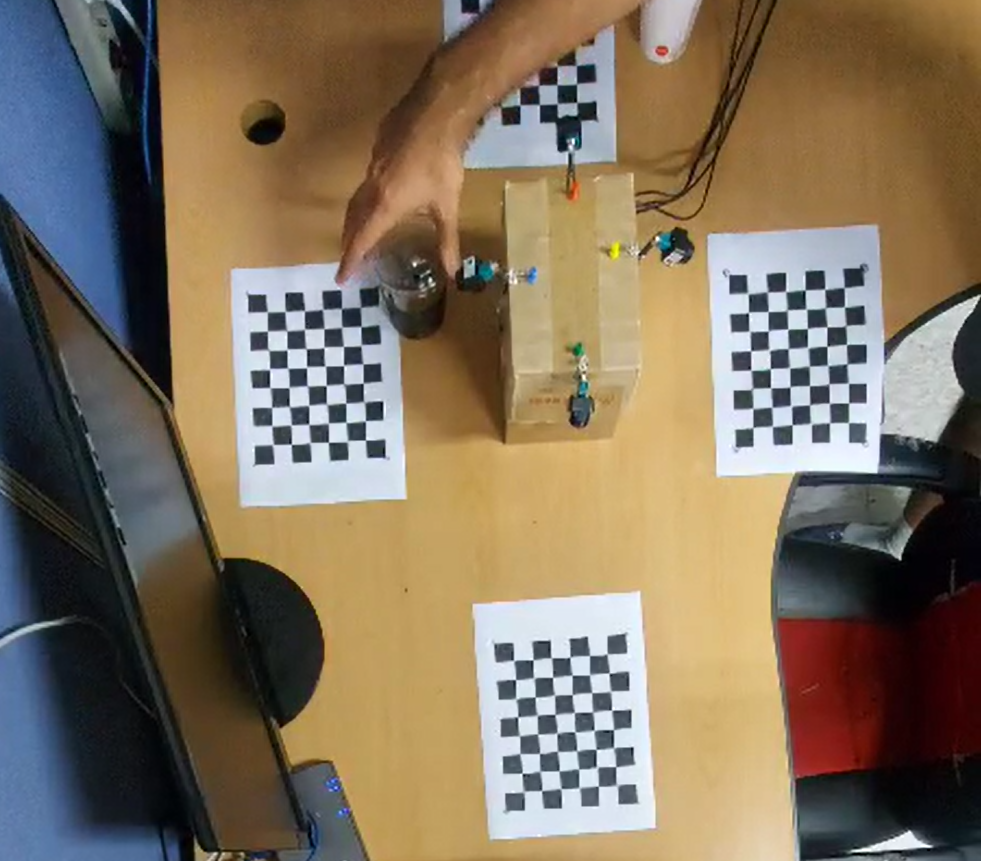

# SVM
Surrounding View Monitoring
# Rounding View Monitoring Application

Welcome to the Rounding View Monitoring Application repository! This application is designed for deployment on an embedded board equipped with four cameras to monitor the surroundings effectively.

## Test Video

To get a glimpse of the top view of the monitored scene, you can find a test video at the following location:

## Application Output

Curious about the application in action? Check out the output displayed on the board's screen by watching the demo video:

Feel free to explore and contribute to this project! If you have any questions or suggestions, don't hesitate to reach out. Happy monitoring!

